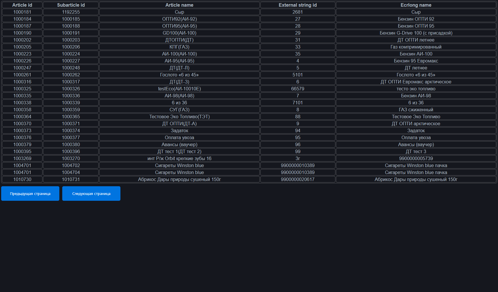
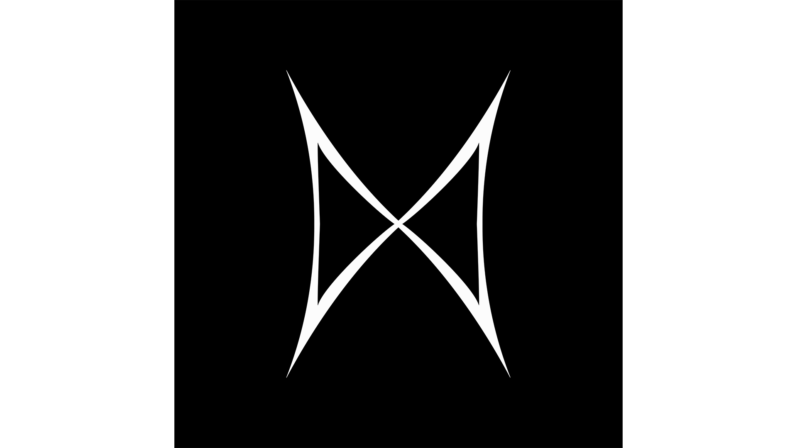

# 👋Hey there, it's me, kingnes!
**`Digital Craftsman`**

I'm a software engineer who graduated from Saint-Petersburg State University of Telecommunications. I mostly do frontend development but also tried fullstack, building desktop apps and even tried to make games! I also have a YouTube channel [kingnes](https://www.youtube.com/@k1ngnes).

My main tech stack is React, Typescript and Tailwind. I really like frontend development, being able to make graphic user interface and connect it with a server is fantastic.
***
## 💻Some of my projects
<table>
  <tr>
    <td>
      <a href="https://github.com/k1ngnes/gazprom-test">gazprom-test</a>
      
The main goal was to make a server which reads a long CSV file and then sends it to the client. On the client side this CSV file renders as a table with pagination. It was made with React and NodeJS, put together in Docker Compose

      
    </td>
    <td>
      <a href="https://github.com/k1ngnes/gazprom-test">artsofte-test</a>
      
In this project I did a list of companies with Google's material paginator. List of companies is coming from an fake API dummy. You can also sort these companies and filter them, there is an individual company information page too! Everything is done with Angular and Typesript, SCSS for styling.

      
    </td>
  </tr>
</table>

***
## My hobbies outside of software development:
  - Computer games
  - Video editing
  - Learning new languages
  

